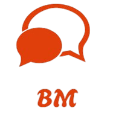

# bmchat
BM Chat is  **real-time chat application** built with **Django REST Framework** backend and **React.js** frontend.   Supports authentication, to-do lists, chat messaging, message translation, and suggested auto-replies.

---

## Features :
- JWT authentication (login, register, logout, refresh token)
- User profiles
- To-do list (CRUD + mark as completed)
- Real-time chat with file attachments
- Message translation (Google Translate)
- Suggested auto-replies based on keywords

---

## Tech Stack :
- **Backend:** Django, Django REST Framework, SimpleJWT, Googletrans  
- **Frontend:** React.js, Axios, JWT Decode, SweetAlert2, Day.js

## Installation :

### Backend
- python -m venv venv
- venv\Scripts\activate
- pip install -r requirements.txt
- python manage.py migrate
- python manage.py runserver

### Frontend
- npm install
- npm start

